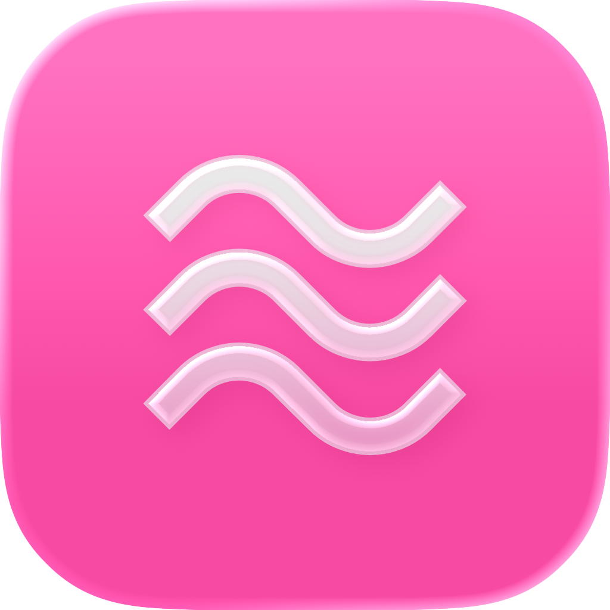
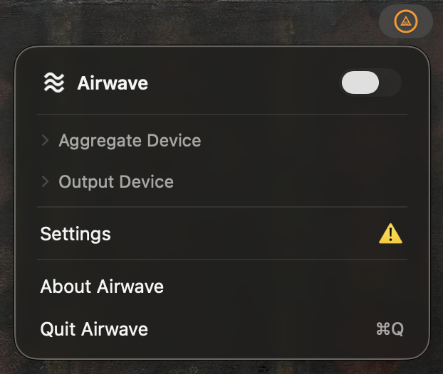
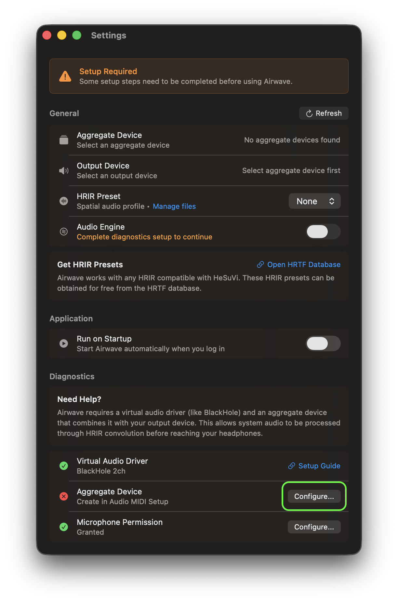
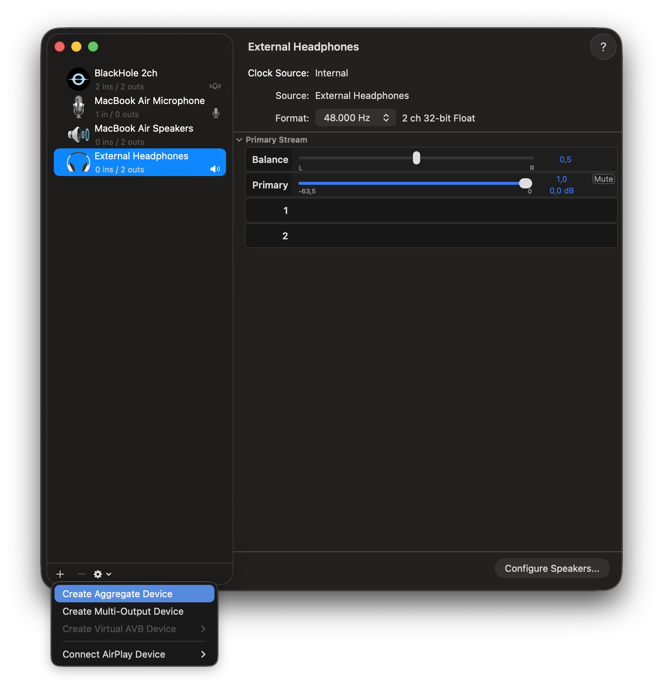
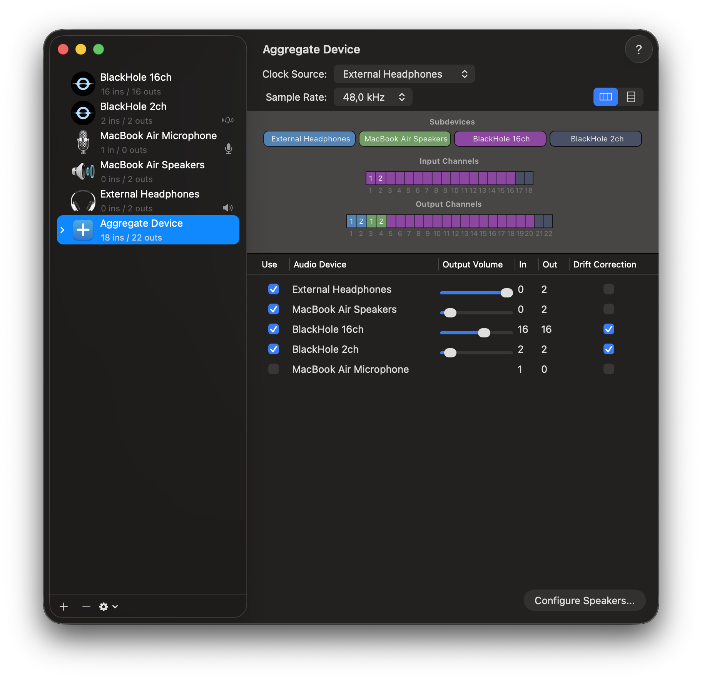
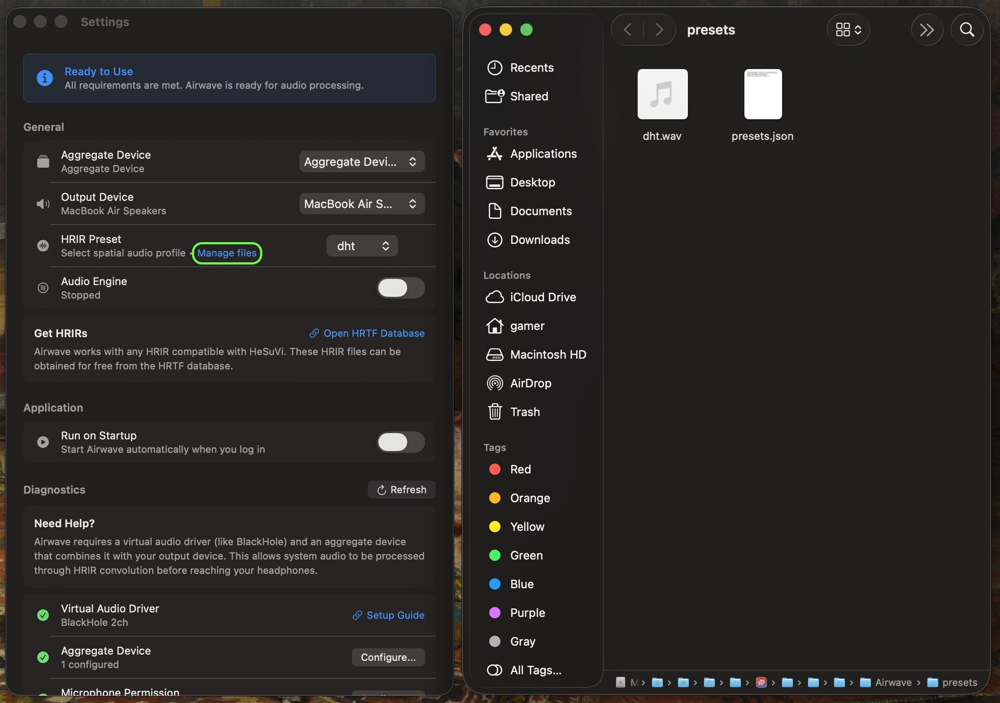
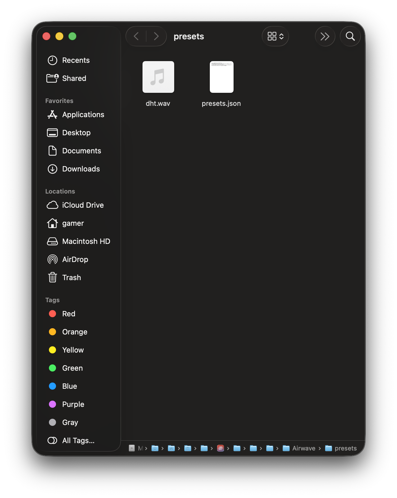
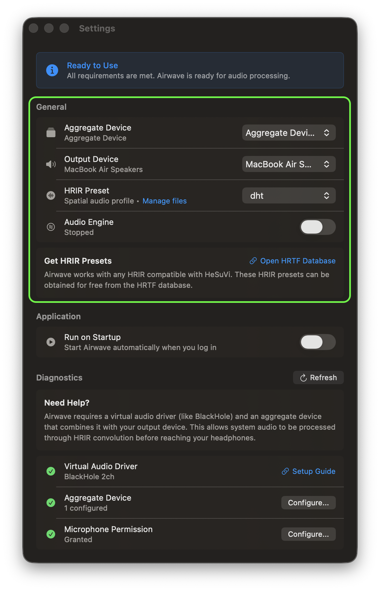

<div align="center">
   <h1 style="border-bottom: none; margin-bottom: 8px">Airwave</h1>
   
   <p>A macOS application that provides system-wide spatial audio through headphones. Compatible with HeSuVi HRIR presets.</p>
   
   <br/>

   <strong>Version: </strong>1.0.0
   <br />
   <a href="https://github.com/sallliisa/Airwave/releases"><strong>Download</strong></a>
    · 
   <a href="https://github.com/sallliisa/Airwave/commits">Commits</a>

   <br/>

   If you find this useful, consider supporting the project.

   [](https://ko-fi.com/Q5Q51RNAGT)

   <br/>

   <strong>Table of Contents</strong>
   <br/>
   [About](#About) • [Features](#Features) • [Requirements](#Requirements) • [Installation](#Installation) • [License](#License) • [Credits](#Credits) • [Support](#Support)
</div>

## About
Airwave is a source-available, non-commercial, macOS application that provides system-wide spatial audio for stereo outputs using HRIR convolution. Airwave is heavily inspired by HeSuVi and is compatible with HeSuVi HRIR presets.

This project was created to offer a free, customizable alternative to proprietary spatial audio applications.

## Features
**1. System-wide audio processing with HRIR convolution**: Routes system audio through a real-time HRIR convolution pipeline to produce spatial audio. Supports any HRIR presets that HeSuVi uses.

**2. Input/output device and volume management**: Manages device volume and selection automatically, on launch and on exit. Manual aggregate device setup is required.

**3. Resource-efficient real-time processing**: ~1% of a single CPU core, ~0.125% of total CPU capacity on an 8-core M1 MacBook Air using the `dht` preset

## Requirements
- macOS 14.0 or later
- Virtual audio device (e.g., BlackHole 2ch)

## Installation
### 1. Install Virtual Audio Device (BlackHole 2ch Recommended)
Any virtual audio device should work; however, BlackHole 2ch has been extensively tested and is recommended for use with Airwave. 

Install BlackHole 2ch using Homebrew:
```bash
brew install blackhole-2ch
```

Or download and install it from [ExistentialAudio/BlackHole](https://github.com/ExistentialAudio/BlackHole)

### 2. Get Airwave
Download Airwave and copy it to your Applications folder. The latest release can be downloaded from [Airwave Releases](https://github.com/sallliisa/Airwave/releases).

> [!IMPORTANT]
> This step is necessary, because the app has not been notarized by Apple due to the membership fees of the Apple Developer Program. "Apple could not verify 'Airwave.app' is free of malware" refers to the [lack of notarization](https://support.apple.com/en-us/102445), not to any anomalies detected.

On macOS 14 Sonoma:
1. Right click `Airwave.app`
2. Click "Open"
3. Click "Open" in the dialog box

On macOS 15 Sequoia or above:
1. Try to open the app, it will tell you it's blocked
2. Go to `System Settings > Privacy & Security` and scroll to the bottom
3. Click "Open Anyway" to allow Airwave to open
4. Click "Open Anyway" on the next dialog box and authenticate
5. Open Airwave again from Applications folder

On first launch, the Airwave menu bar icon indicates that additional setup is required. Click the menu bar icon and open Settings to view the required setup steps.

||
|:--:|
| **Fig. 1**. *Airwave Incomplete Setup Warning* |

### 3. Set Up an Aggregate Device

From the Airwave Settings menu, scroll down to the Diagnostics section, and click `Configure` under `Aggregate Device`. This will open the Audio MIDI Setup application.

||
|:--:|
| **Fig. 2**. *Setup Aggregate Device Notice* |

In Audio MIDI Setup, click the `+` button in the bottom-left corner and select `Create Aggregate Device`.

In the newly created aggregate device, enable `BlackHole 2ch` (or another virtual audio device) in the `Use` column, then enable any physical output devices you want Airwave to make available as output options. After you're done, make sure to only check the `Drift Correction` box only on the `BlackHole 2ch` (or any virtual audio device that you are using).

|||
|:----------:|:----------:|
| **Fig. 3**. *Create Aggregate Device* | **Fig. 4**. *Aggregate Device Setup* |

### 4. Get HRIR Presets
Airwave does not ship with any HRIR presets.
You can download them for free from the [HeSuVi HRTF Database](https://airtable.com/embed/appac4r1cu9UpBNAN/shrpUAbtyZxhDDMjg/tblopH2GznvFipWjq/viwnouWPGDuYEd8Go).

After downloading the `.wav` files, click on `Manage files` under `HRIR Presets`. Move the files into the folder shown, and the presets will be automatically detected and ready for use.

|||
|:--:|:--:|
| **Fig. 5**. *Manage HRIR Presets* | **Fig. 6**. *HRIR Presets Folder* |

### 5. Start Using Airwave
Airwave is now ready to use. Any issues or warnings will appear in the `Diagnostics` section of Settings.

To get started, choose:
- the **aggregate device** you created,
- the **output device** you want audio to play through,
- the **HRIR preset** you prefer,

then start the audio engine.

These controls are available in Settings, and can also be accessed later from the menu bar.

||
|:--:|
| **Fig. 7**. *General Setup* |

## License
Airwave is currently licensed under the GNU General Public License v3. I believe macOS tools should be accessible to everyone, free from the high price tags or and the subscription models that dominate the ecosystem.

## Credits
- Inspired by the original concept and implementation of [HeSuVi](https://sourceforge.net/projects/hesuvi/). This project is independently developed and not affiliated with the HeSuVi project.
- Supports HRIR datasets obtained from the [HeSuVi HRTF Database](https://airtable.com/embed/appac4r1cu9UpBNAN/shrpUAbtyZxhDDMjg/tblopH2GznvFipWjq/viwnouWPGDuYEd8Go). HRIR files are provided by third parties and are subject to their respective licenses.
- Designed to work with [BlackHole](https://github.com/ExistentialAudio/BlackHole) for virtual audio routing.
- [Material Symbols](https://fonts.google.com/icons) used for the app and menu bar icon.
- The notice and the steps to resolve the signing issue copied from [Battery Toolkit](https://github.com/mhaeuser/Battery-Toolkit).

## Support
For issues and feature requests, please [file an issue on GitHub](https://github.com/sallliisa/Airwave/issues).

If you find Airwave useful, consider supporting its continued development through a [voluntary donation](https://ko-fi.com/Q5Q51RNAGT). Donations help cover development time and ongoing maintenance, and are greatly appreciated.

[](https://ko-fi.com/Q5Q51RNAGT)
