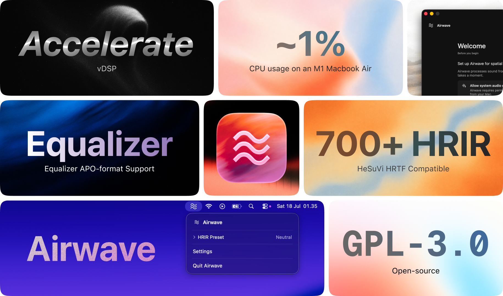
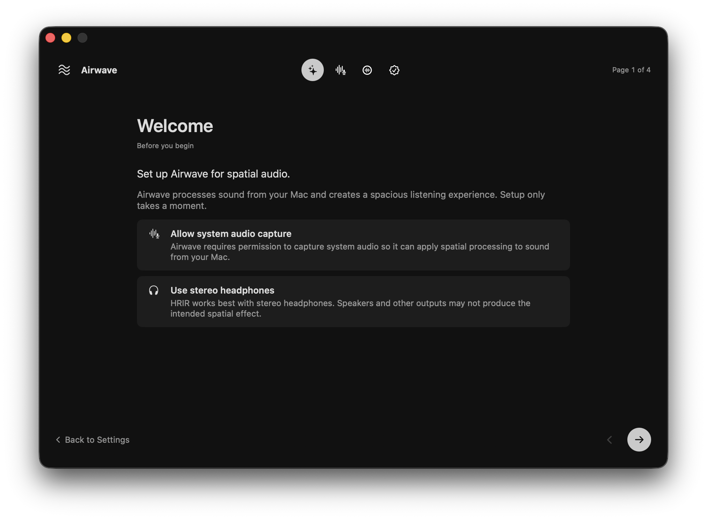
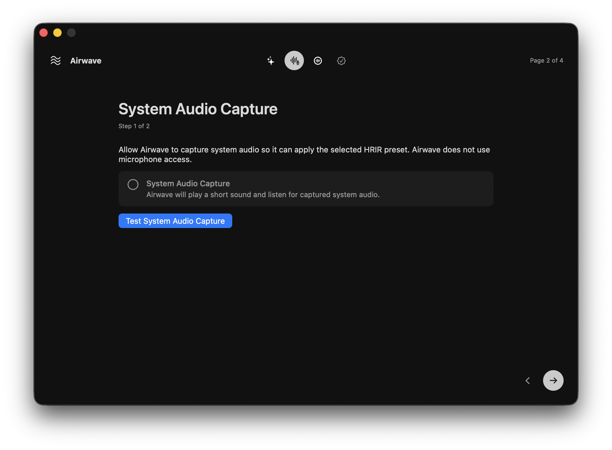
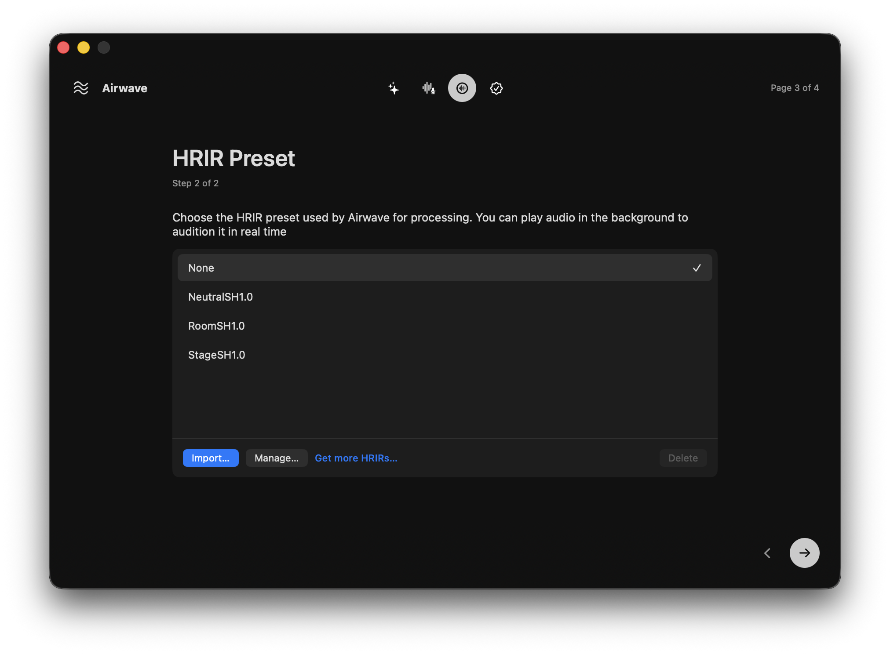
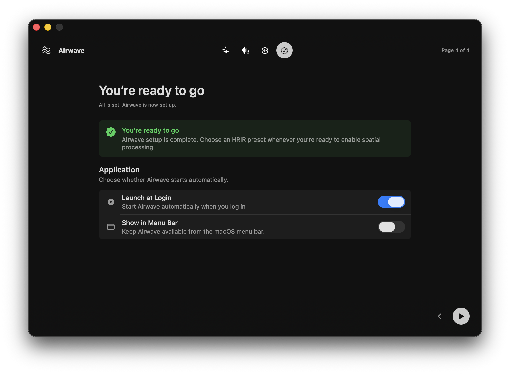
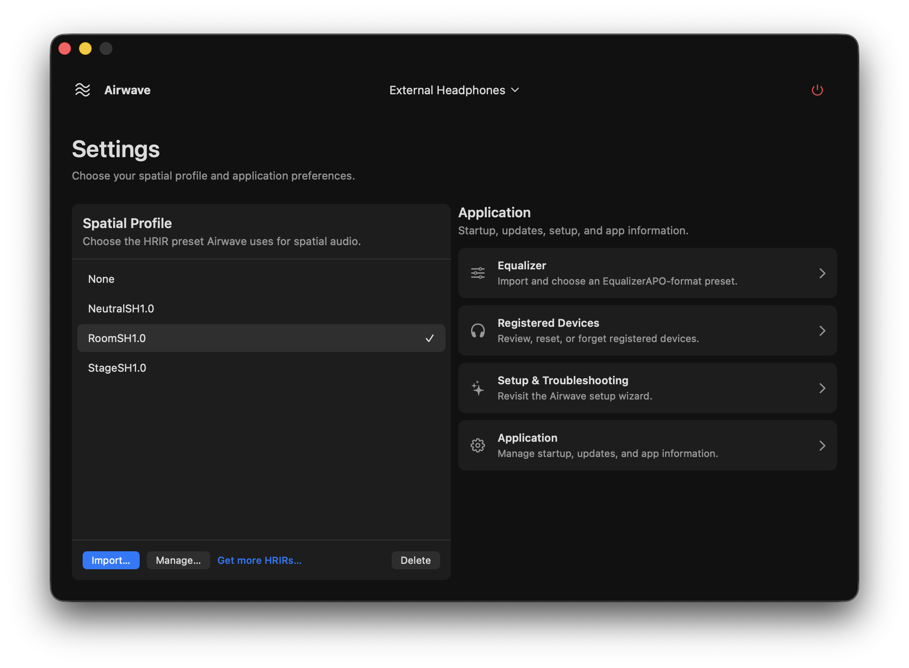
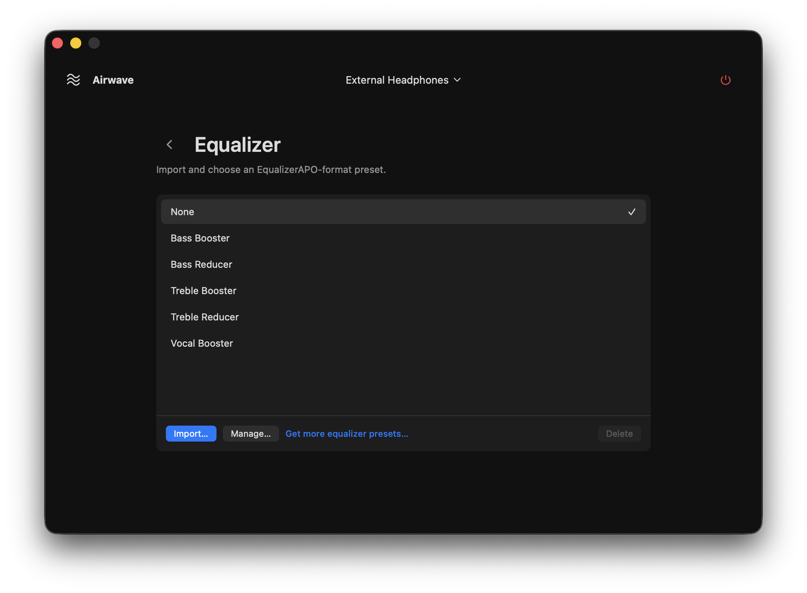
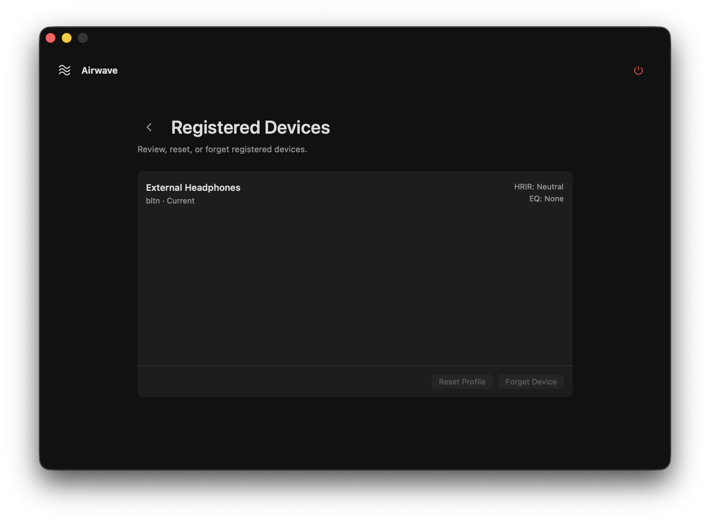
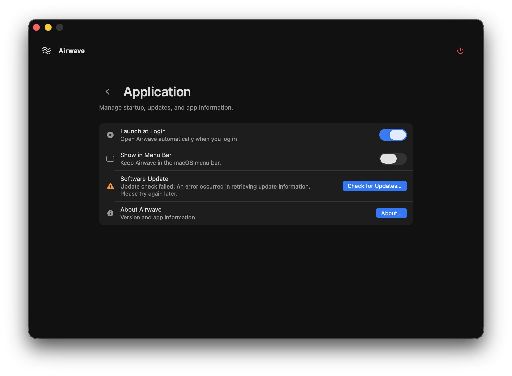

<div align="center">
  <h1 style="border-bottom: none; margin-bottom: 8px">Airwave</h1>
  
  <p>System-wide spatial audio for macOS headphones.</p>

  <p>
    <a href="https://github.com/sallliisa/Airwave/releases/latest"></a>
  </p>
  <p>
    <a href="https://github.com/sallliisa/Airwave/releases"><strong>Download Airwave</strong></a>
    ·
    <a href="https://github.com/sallliisa/Airwave/issues">Support</a>
  </p>

  
</div>

## What Airwave does

Airwave captures audio from your Mac, applies a spatial audio profile, and plays the result through your current stereo output. It uses HRIR convolution to create a wider, more speaker-like listening experience in headphones.

Airwave is designed for stereo headphones. The spatial effect may not sound as intended through speakers or other non-headphone outputs.

Airwave follows your normal macOS output selection and volume. You do not need to manage a second audio route while using the app.

## Requirements

- macOS 15 Sequoia or later
- Stereo headphones
- System Audio Capture permission

Airwave does not use microphone access.

## Installation

### Homebrew

```bash
brew tap sallliisa/airwave
brew install --cask airwave
```

### Download

Download the latest release from [GitHub Releases](https://github.com/sallliisa/Airwave/releases), open the ZIP file, and move `Airwave.app` to your Applications folder.

If macOS stops the app from opening, try opening it once, then go to **System Settings > Privacy & Security** and choose **Open Anyway** for Airwave.

## First launch

Airwave opens a short setup wizard the first time you run it. It has four pages and takes only a moment.

### 1. Welcome

The welcome page explains the two things Airwave needs: permission to capture system audio and stereo headphones for the spatial effect.



### 2. Allow system audio capture

Click **Test System Audio Capture**. macOS will ask for permission to let Airwave capture system audio. Follow the prompt, then run the test again if needed.

Airwave plays a short test sound and checks that it can receive captured audio. If access is not enabled, the setup page gives you a button to open the relevant macOS privacy setting.



### 3. Choose an HRIR preset

Choose an HRIR preset from the list. Airwave includes `NeutralSH1.0`, `RoomSH1.0`, and `StageSH1.0` presets to get you started. You can listen to audio while switching presets so you can choose the one you prefer.

Airwave also accepts compatible HeSuVi HRIR `.wav` files. Use **Import…** to add files, **Manage…** to open Airwave's preset folder, or **Get more HRIRs…** to visit the [HeSuVi HRTF Database](https://airtable.com/embed/appac4r1cu9UpBNAN/shrpUAbtyZxhDDMjg/tblopH2GznvFipWjq/viwnouWPGDuYEd8Go).

Selecting **None** leaves spatial processing off. You can choose a preset later from Settings or, if enabled, the menu bar.



### 4. Finish setup

When the capture test and preset setup are complete, Airwave is ready. The final page also lets you choose whether Airwave should launch when you log in and whether it should stay visible in the macOS menu bar.



## Running Airwave

Airwave gives you two ways to use it:

- With **Show in Menu Bar** enabled, Airwave is available from the macOS menu bar. Open its menu to choose the HRIR preset, revisit setup, open Settings, or quit Airwave.
- With **Show in Menu Bar** disabled, Airwave has no visible menu bar icon. It continues processing in the background, which makes it suitable for a set-and-forget setup. Open Airwave again from Applications, Finder, Spotlight, or another app launcher when you need to change a setting.

Changing the HRIR preset takes effect while audio is playing. When no HRIR preset is selected, Airwave leaves audio in its normal form.

Closing the Settings window does not quit Airwave. To stop audio processing and exit Airwave completely, use the power button in Settings or choose **Quit Airwave** from the menu bar menu.

## Settings

Settings shows the current supported stereo output at the top. Airwave remembers a separate profile for each output it sees, so a pair of headphones can keep its own HRIR and EQ choices when you switch between devices.



### Spatial profiles

The **Spatial Profile** section is where you choose the HRIR preset for the output shown at the top of the window. Airwave's bundled presets are available immediately, and imported HeSuVi-compatible WAV files appear in the same list.

### Equalizer

The optional Equalizer uses EqualizerAPO-format `.txt` presets. Airwave includes five presets:

- Bass Booster
- Bass Reducer
- Treble Booster
- Treble Reducer
- Vocal Booster

Choose **None** to bypass the Equalizer. Use **Import…** to add your own EqualizerAPO preset, **Manage…** to open Airwave's managed preset folder, or **Get more equalizer presets…** to browse [AutoEq](https://autoeq.app/). You can delete imported presets from the library.



The HRIR and Equalizer settings are independent. You can use spatial processing, EQ processing, both together, or neither.

### Registered Devices

**Registered Devices** lists the outputs Airwave remembers. Each device shows its transport, whether it is current, and the HRIR and EQ presets assigned to it.

- **Reset Profile** changes both HRIR and EQ to `None` for the selected device.
- **Forget Device** removes a device that is not currently in use. If it is available again later, Airwave can create its profile again from the device selector.



### Application

The **Application** page contains preferences and app information:

- **Launch at Login** starts Airwave when you log in.
- **Show in Menu Bar** keeps Airwave available from the macOS menu bar. Turn it off to run Airwave as a hidden background app.
- **Software Update** checks for a newer Airwave release.
- **About Airwave** shows the installed version and app information.



## Troubleshooting

### Airwave says system audio capture needs attention

Open setup from **Settings > Setup & Troubleshooting** and run **Test System Audio Capture**. If macOS asks for access, allow Airwave under **System Settings > Privacy & Security > System Audio Capture**, then test again.

### The spatial effect is not audible

Check that:

1. Your headphones are the current macOS output.
2. The output is a supported stereo physical device.
3. An HRIR preset other than `None` is selected.
4. Airwave's capture test has passed.

### A device is not available

Connect the headphones and select them as the macOS output. Airwave watches for supported outputs and adds them to the device selector when they become available.

## License

Airwave is licensed under the [GNU General Public License v3](LICENSE).

## Credits

- Airwave is inspired by [HeSuVi](https://sourceforge.net/projects/hesuvi/) and supports compatible HRIR datasets. Airwave is independently developed and is not affiliated with HeSuVi.
- HRIR files from the [HeSuVi HRTF Database](https://airtable.com/embed/appac4r1cu9UpBNAN/shrpUAbtyZxhDDMjg/tblopH2GznvFipWjq/viwnouWPGDuYEd8Go) are provided by third parties and remain subject to their respective licenses.
- Equalizer preset discovery is provided through [AutoEq](https://autoeq.app/).
- [Material Symbols](https://fonts.google.com/icons) are used for app and menu bar icons.

## Support

For bugs and feature requests, [open an issue on GitHub](https://github.com/sallliisa/Airwave/issues).

If Airwave is useful to you, you can support its development with a [voluntary donation on Ko-fi](https://ko-fi.com/Q5Q51RNAGT).

[](https://ko-fi.com/Q5Q51RNAGT)
